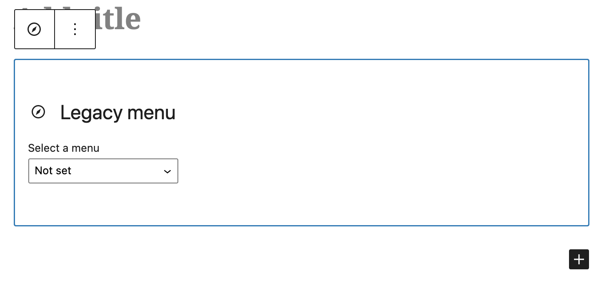

# Classic Menu Block

Stable tag: 0.1.5  
Requires at least: 5.9  
Tested up to: 5.9  
Requires PHP: 5.6  
License: GPL v2 or later  
Tags: block, menu, navigation  
Contributors: spacedmonkey  
Donate link: <https://github.com/sponsors/spacedmonkey>

A gutenberg block to use classic menus.

## Description

Use classic menus in gutenberg, using this block. This block renders classic menu data using wp_nav_menu function, improving backwards compatiblity.

## Installation

This section describes how to install the plugin and get it working.

1. Upload the plugin files to the `/wp-content/plugins/classic-menu-block` directory, or install the plugin through the WordPress plugins screen directly.
1. Activate the plugin through the 'Plugins' screen in WordPress

## Screenshots

1. The navigation block  

### Do you accept donations?

[I am accepting sponsorships via the GitHub Sponsors program](https://github.com/sponsors/spacedmonkey) and any support you can give will help me maintain this plugin and keep it free for everyone.

<!-- changelog -->
